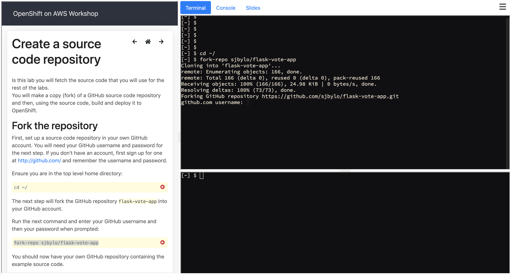

# OpenShift 4 with AWS Broker Workshop

This workshop is for OpenShift version 4.1 and above. It provides an intriduction to OpenShift and 
developing an application which connects to an instance of MySQL via the Relational Database Service (RDS) of AWS. 

The workshop exercises can be found [here](https://github.com/sjbylo/lab-ocp4/tree/master/workshop/content/exercises).

This workshop uses the [AWS Broker](https://github.com/awslabs/aws-servicebroker/) to provision an RDS instance in AWS.  
The Broker needs to be installed and 
working on the OpenShift cluster for two of the exercises to work.  The instructions to install the
AWS Broker are [here](https://github.com/awslabs/aws-servicebroker/blob/master/docs/getting-started-openshift.md).
Note that, even if the AWS Broker is not available the other exercises still provide considerable learning of OpenShift. 

Please note this issue when installing the AWS Broker on OpenShift 4.1 https://github.com/awslabs/aws-servicebroker/issues/139 

# Setup of the workshop using RHPDS 

A Red Hat RHPDS OCP 4.x cluster can be provisioned and used for this workshop.  The AWS Service Broker (AWSSB) is then installed and configured onto the RHPDS cluster.  The AWSSB can be configured to manage services in a separate AWS account (target account).  There are a few prerequisites that need to be configured into the target account which are described in the AWSSB documentation. 

## Increase the RDS limits in the Target AWS Account

If needed, the following [Amazon RDS limits need to be increased](https://console.aws.amazon.com/servicequotas/home#!/services/rds/quotas) to match the number of RDS instances (i.e. one per attendee) needed for the workshop.  It takes AWS about 3-5 days to make the changes. These are the limits that need increasing, e.g. to 60: 

```
DB Instances (0/60)
Parameter groups
  Custom (0/60)
Option groups:
  Custom (0/60)
Subnet groups (0/60)
```

## Setup of the Target AWS Account 

Follow the [instructions](https://github.com/awslabs/aws-servicebroker/blob/master/docs/getting-started-openshift.md) to allow the target account to be managed by the AWS Service Broker (AWSSB).  This entails setting up IAM and a DynamoDB table. 

Following are the steps that were used to configure AWSB onto a OCP 4.1 cluster, provisioned via RHPDS. 

Ensure the "Broker Management" option appears in the OpenShift Menu.  If this is already visible then there is probably no need to execute the next two commands.

As cluster admin, run the following: 

```
oc patch servicecatalogapiservers cluster --patch '{"spec": {"managementState": "Managed"}}' --type=merge

oc patch servicecatalogcontrollermanagers cluster --patch '{"spec": {"managementState": "Managed"}}' --type=merge
```

The output iof these commands should show "patched". 

Wait for at least 30 minutes for the Service Catalog to be configured and for the "Broker Management" option to appear in the OpenShift menu.  

## Deploy AWS Service Broker on the RHPDS OpenShift cluster 

Follow the ["Getting Started Guide - OpenShift"](https://github.com/awslabs/aws-servicebroker/blob/master/docs/getting-started-openshift.md) to run the "deploy.sh" script which will deploy AWSSB.  

After running the "deploy.sh" script you should observer the following in the logs:

```
oc logs aws-servicebroker-6dcd88cc7d-mrbzc -n aws-sb 
...
converting service definition "rdsmssql"
...
Starting server on :3199
```

# Homeroom workshop setup

This workshop uses Homeroom. If you are interested in Homeroom, a good place to start learning about it is by running it's [workshop on how to create content for Homeroom](https://github.com/openshift-homeroom/lab-workshop-content).

The dashboard for the workshop environment should look like:



## How to launch the workshop on OpenShift

To launch the workshop, first clone a copy of this Git repository to your own computer.

```
git clone https://github.com/sjbylo/lab-ocp4.git
```

Then within the Git repository directory, run:

```
git submodule update --init --recursive
```

This will checkout a copy of a Git submodule which contains scripts to help you deploy the workshop.

You now have two choices to deploy the workshop. You can deploy it for just yourself, or you can deploy it for a workshop where you have multiple users.

To deploy it just for yourself, run:

```
.workshop/scripts/deploy-personal.sh
```

To deploy it for a workshop with multiple users, run:

```
.workshop/scripts/deploy-spawner.sh
```

Note that you will need to be a cluster admin in the OpenShift cluster to deploy a workshop for multiple users.

Once the deployment has completed, because this workshop is not currently setup to be automatically built into an image and hosted on an image registry, you will need to manually build the workshop image.

To build the workshop image run:

```
.workshop/scripts/build-workshop.sh
```

If you make changes to the workshop content, you can run this build command again. In the case of deploying it just for yourself, the workshop deployment will be automatically re-deployed. If you have deployed it for multiple users, any users currently using the workshop environment, will need to select "Restart Workshop" from the menu of the workshop dashboard.

Once deployed, visit the URL route for the workshop. You will be prompted to login to the OpenShift cluster. Use your own username and password. In the case of deploying the workshop for yourself, you will need to have been a project admin for the project it is deployed in.

You can learn more about the scripts used to perform the deployment by looking at the README and files contained in the `.workshop/scripts` directory.

If you need to ever update the deployment scripts to the latest version run:

```
git submodule update --recursive --remote
```

This will update the commit reference for the Git submodule, so if you want to keep it for the future, you will need to commit the change back to the repository.

To delete a personal workshop instance when done, run:

```
.workshop/scripts/delete-personal.sh
```

To delete a multi user workshop instance when done, run:

```
.workshop/scripts/delete-spawner.sh
```

Also delete the build configuration for the workshop image by running:

```
.workshop/scripts/delete-workshop.sh
```
