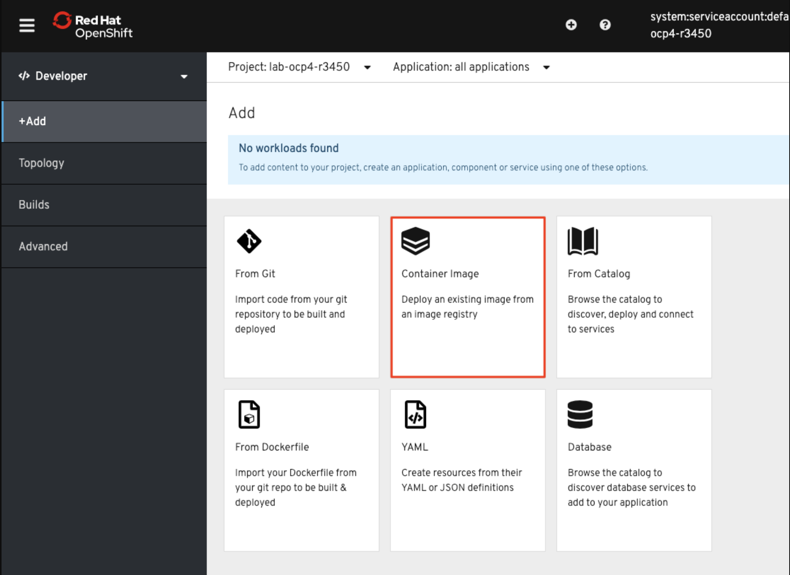
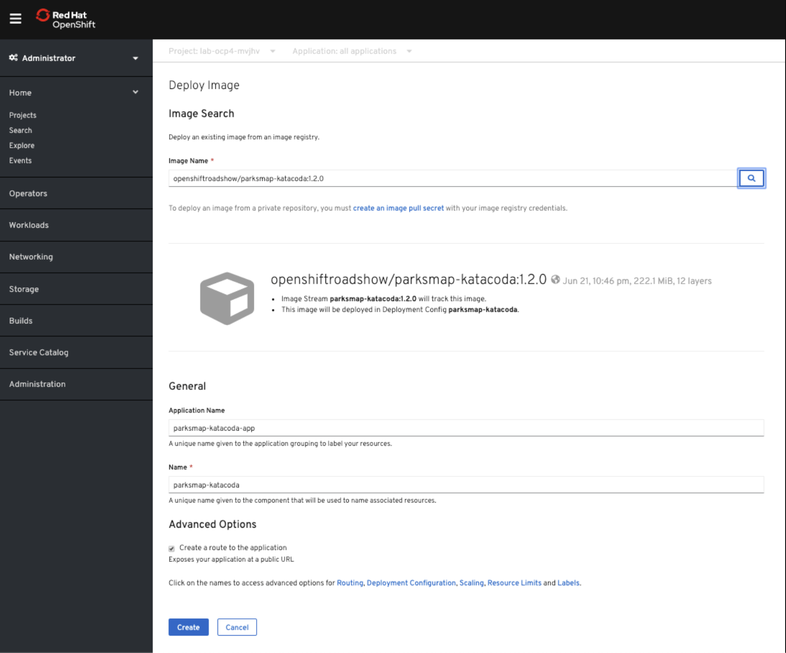
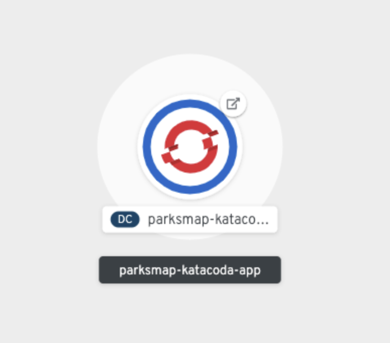
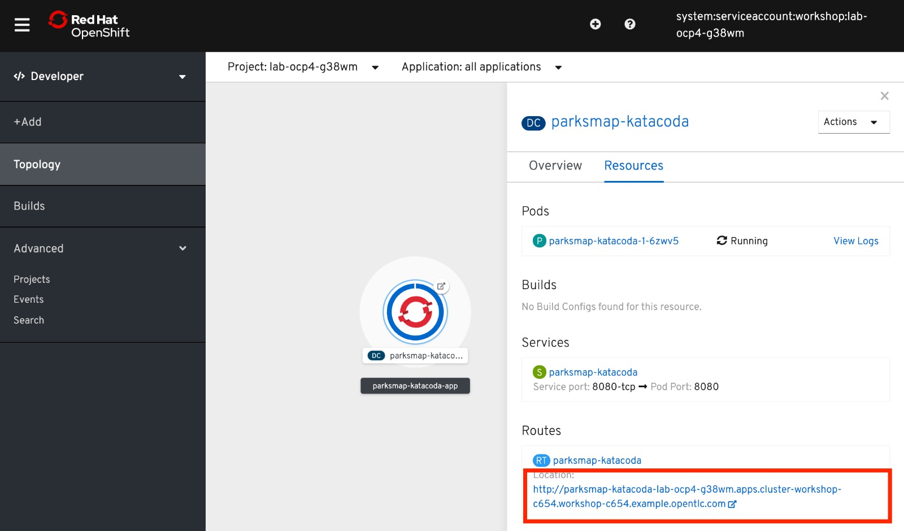

In this exercise, you will try out how to deploy a containerized application via the web console. OpenShift Container Platform offers different ways to deploy your applications. You can deploy a container image; or point OpenShift Container Platform to a source code repository to build and deploy the application. It also allows you to deploy an entire workload via Templates. In this exercise, we will see how easy it is to deploy a simple container image via the web console.

On the 'Console' tab, click on 'Home' -> ['Projects'](%console_url%) . You will see the project that was created for you. You will deploy your applications in this project.


Click on the project and you will be brought to the project console which shows that there is no workload running.

Now switch to the ``Developer`` perspective by clicking on the ``Administrator`` left-menu item at the top and selecting ``Developer``.  You will see the Developer perspective which focuses on everything that a developer would be concerned about.

You can now deploy a container by clicking on the ``+Add`` menu item.

To deploy a container image, click on '+Add' in the left menu.



On the deploy 'Container Image' page, enter:

```copy
openshiftroadshow/parksmap-katacoda:1.2.0
```

into the 'Image Name' text box and click on the magnifying class icon at the side. This will trigger a query from Docker hub to pull down the image information.

Enter an "myapp" for the ``Application Name`` and also for the ``Name`` fields. 

Click on 'Create' button to deploy the container image on OpenShift. Behind the scenes, OpenShift will pull down the image, create the necessary OpenShift objects (services, deploymentConfig) and deploy the image.



You will be lead to the Topology view showing your application.



Click on the application donut to open up a side menu with more information.




You will be lead to the page displaying information on the Route object.  Under the ```Location``` section on the right of the page, is the URL to access the application.


Click on the URL to access the application.  The application simply displays a map of the world.  If you see that, the application is running successfully!!


You have just got your first application running on OpenShift.  Congratulations!

Clean up the resources for this exercise, you won't be using them anymore.

```execute
oc delete all --all
```

In your terminal you should see all the configurations and objects being deleted. You will see similar output to the following:

```
pod "parksmap-katacoda-1-9f8xx" deleted
pod "parksmap-katacoda-1-deploy" deleted
replicationcontroller "parksmap-katacoda-1" deleted
service "parksmap-katacoda" deleted
deploymentconfig.apps.openshift.io "parksmap-katacoda" deleted
imagestream.image.openshift.io "parksmap-katacoda" deleted
route.route.openshift.io "myname" deleted
```

This concludes the section of the Lab.
