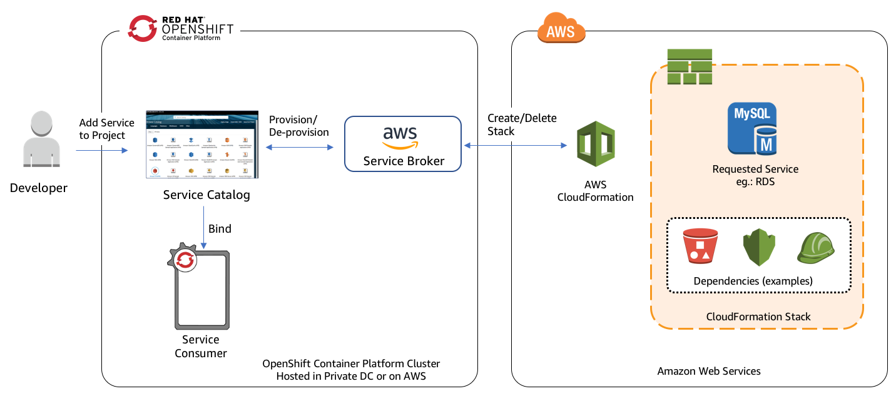

In this exercise you will provision an AWS Relational Database Service (RDS) instance so that - ``in a later exercise`` - you can configure your application to use it.  Amazon RDS makes it easy to set up, operate, and scale MySQL deployments in the cloud. 

We will use the ``AWS Service Broker`` to provision the database.

- ``The AWS Service Broker is an open source project that allows native AWS services to be exposed directly through Red Hat OpenShift and Kubernetes. The Broker provides simple integration of AWS Services directly within OpenShift.``



Using the ``AWS Broker`` - which is configured and running on this OpenShift cluster - provision an AWS RDS MySQL service.  Connect the MySQL database to the application and test it. 

# Provision a RDS MySQL database using the service catalogue 

To initiate the provisioning of RDS run the following ``svcat`` command: 

```execute
svcat provision mysql --class rdsmysql --plan custom  \
   -p PubliclyAccessible=true \
   -p DBName=vote \
   -p AccessCidr=0.0.0.0/0 \
   -p MasterUsername=user \
   -p MasterUserPassword=ocpWorkshop2019 \
   -p MultiAZ=false \
   -p DBInstanceClass=db.m4.large \
   -p AutoMinorVersionUpgrade=false \
   -p PortNumber=13306 \
   -p BackupRetentionPeriod=0 
```
 <!-- -p VpcId=vpc-03a00c0e08cc9bec3  note that this param is not needed.  The AWS Service Broker should be configured with the target VPN -->

As specified in the above command, an instance of MySQL will be provisioned with an instance type of ``db.m4.large`` and will be accessible publicly. 

Check the status of the RDS instance from the command line:

```execute
svcat get instances
```

The status should be ``Provisioning``.  Note that the database takes about 20 minutes to provision. We will use it in a later exercise. 

If you wish to explore in the console, go to the [Service Catalog](%console_url%/catalog/ns/%project_namespace%). You will see many technologies which can be utilized.  One of them is the RDS Service.  In the search box, enter ``rds``.  You will see the ``Amazon RDS for MySQL`` service class.  Click on this "Amazon RDS for MySQL" to read information about this service.  Then click on the ``Create Service Instance``  button to view all of the parameters that _can_ be used to define the MySQL instance.  The most important options are:

1. Service Instance Name
1. DB Instance Class
1. Master User Password
1. DBName
1. StorageEncrypted 
1. Publicly Accessible
1. Master Username

``Please note: DO NOT fill in this form and DO NOT click on the "Create" button at the bottom of the page!``  You already provisioned the RDS instance above using the ``svcat`` command. 

Take a look in the console at the [Provisioned Services](%console_url%/provisionedservices/ns/%project_namespace%/) and check the status of the RDS instance.  You should see ``Not ready``.  If you drill down into the ``mysql`` service object you should also be able to see ``The instance is being provisioned asynchronously`` at the bottom of the page.   You will also see that there are no ``Service Bindings``. A service binding is a link between a service instance and an application.  Don't worry, we will create that in a future exercise.  


 - Sometimes, the RDS instance fails to provision due to overlapping network segments being automatically selected (or some other reason).  In this case you will eventually see the status as ``Failed``.  
 - If there is a problem provisioning the RDS instance, you will need to remove it and try again.  To remove the failing RDS instance, run the command `"svcat deprovision mysql"`.  <!--follow the steps in the section ``Remove the RDS Instance`` in the last exercise exercise called [Clean up](90-clean-up).  -->

The database takes about 20 minutes to provision. 

---
That's the end of this exercise.

Once you see the instance status as `Provisioning`, move onto the next exercise.
