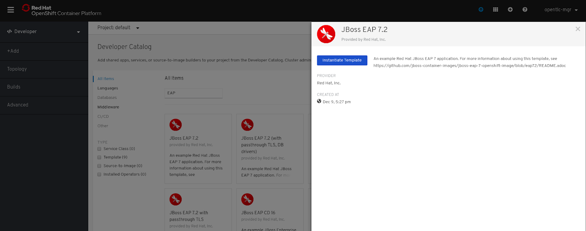
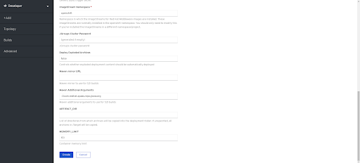
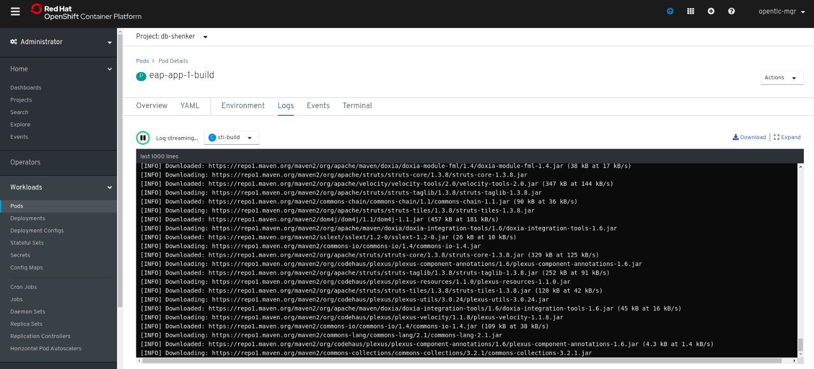

In this exercise you will build & launch a J2EE application directly from source code using the ``template`` and ``Source To Image`` features of OpenShift. 

OpenShift Templates are a way to bundle everything together that is needed to build, deploy and run an application. 

If not already, let's  delete the contents of your project:

```execute
oc delete all --all
```

First, Click on the [Console](%console_url%) tab at the top of the screen. 

If not already, switch to the ``Developer`` perspective (click on the ``Administrator`` menu item and select ``Developer``). 

You can read more about the ``Developer Catalog`` in the [documentation](https://docs.openshift.com/container-platform/4.2/applications/application-life-cycle-management/odc-creating-applications-using-developer-perspective.html#odc-creating-applications-using-developer-perspective) 


Click on * [+Add](%console_url%/k8s/ns/%project_namespace%/add) and then on ``From Catalog``:


  - ``Note``: if you see the error ``Restricted Access``, ensure you select the correct project at the top of the page. 

We are going to create an application from the developer catalog to demonstrate the self service capability from templates pre-provisioned for convenience of usage in the OpenShift environment.


In the search field, search for ``JBoss EAP 7.2``. 

The application of interest will run on the JBoss enterprise application platform, notably ``JBoss EAP 7.2``, as highlighted in the green box. 



Go ahead and instantiate the template, which provides the user with a wealth of customization choices for the creation of the JBoss application. 




Notable configurations are:

``Namespace``: make sure it is your project namespace not the default project

``Application Name``: as per the instructions, or named accordingly depending on the appropriate context.

``Git Repository URL``: Use thee default value.

<!--
> and users are welcomed to use a Git Repo of their choice which works in the creation of the application. 
-->

For demonstration purposes we are only going to use the default settings, though it is encouraged for users to experiment and practice with the environment in their own time and convenience. 

Now, click on the ``Create`` button.

Allow the application to build. 

The blue circle indicates the successful creation of the JBoss EAP Application, which can be accessed via the hostname by clicking on the icon. 


Note this is from the administrator view, the logging allows us to see the process of the creation of the APP for those tracking the progress of application creation. 




This is the expected output once users successfully create the application and access it. 


---

Congratulations!! You are now running a JBoss EAP application on OpenShift.

# Clean up

Remove the application:

```execute
oc delete all --all
```


---

Console links:

* [Pods](%console_url%/k8s/ns/%project_namespace%/pods) - Shows your running pods in your project. 
* [Build Configs](%console_url%/k8s/ns/%project_namespace%/buildconfigs) - resources that build your application images.
* [Deployment Configs](%console_url%/k8s/ns/%project_namespace%/deploymentconfigs) - resources that manage the lifecycle of your application.
* [Routes](%console_url%/k8s/ns/%project_namespace%/routes) - resources that allow access to your applicatin from the external network.
* [Topology](%console_url%/k8s/ns/%project_namespace%/topology) 

